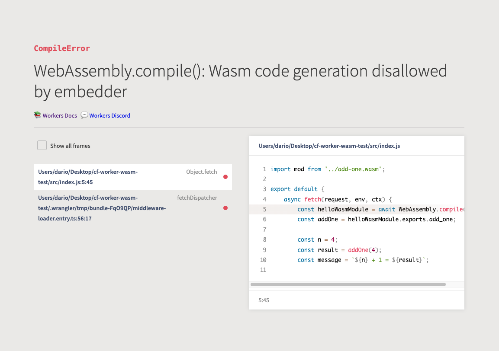
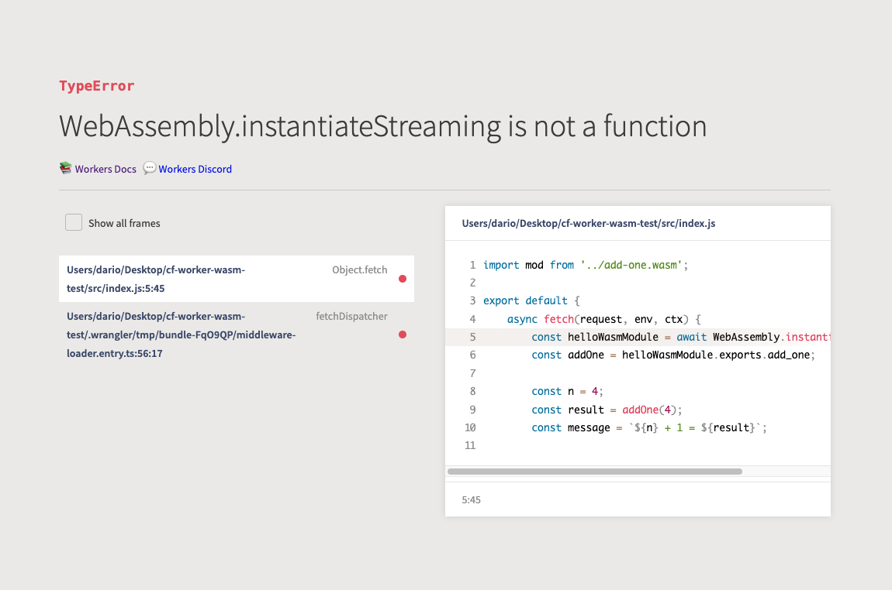
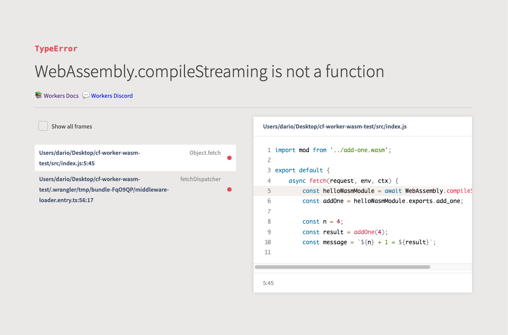

# Cloudflare Workers - `WebAssembly` support test

Quick test to see what instantiation methods are supported by workerd (/Cloudflare workers)

> Note: check the git history so see the manual checks I did

## Results
| Method                             | Variant                       | Works  |
|------------------------------------|-------------------------------|--------|
| `WebAssembly.instantiate`          | with already-compiled modules | ✅ Yes |
| `WebAssembly.instantiate`          | with binary code              | ❌ No  |
| `WebAssembly.instantiateStreaming` |                               | ❌ No  |
| `WebAssembly.compile`              |                               | ❌ No  |
| `WebAssembly.compileStreaming`     |                               | ❌ No  |

## Errors

Although the results above are expected, I noticed that workerd provides a valid error message for `instantiate` and `compile`:

However `instantiateStreaming` and `compileStreaming` provide type errors which seem incorrect to me (and that they should be aligned with the above):

